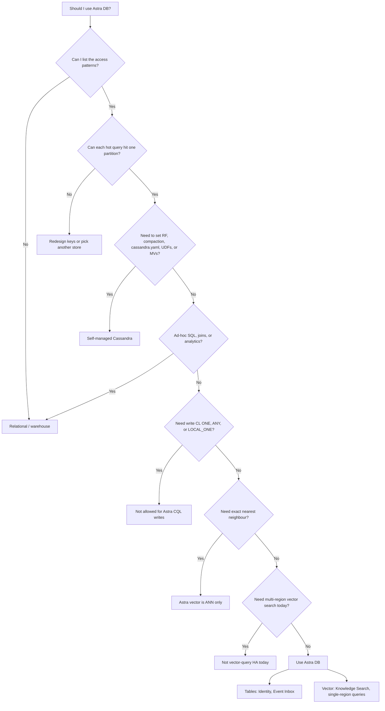
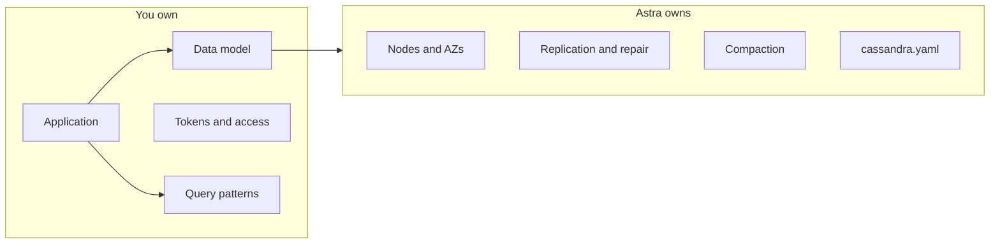

# 01 — Why Astra DB

This module answers:

1. What is Astra DB?
2. Why would I use it?
3. When should I use it?
4. When should I **not** use it?
5. How is it different from self-managed Cassandra?

The decision tree below is the discussion. After the workshop, use the [reference architectures](../reference-architectures/reference-architectures.md) one-pager and the [architecture review checklist](../ARCHITECTURE-REVIEW-CHECKLIST.md).

## What is Astra DB?

**Astra DB Serverless** is a multi-cloud database-as-a-service built on Apache Cassandra. It is optimized for operational workloads that need large data volume, low latency, and flexible data models — including vector search.

You do not provision nodes, pick a snitch, schedule repairs, or choose a compaction strategy. The service scales with usage. You spend time on the data model and the application.

There are two deployment types:

| Type | Use it for |
|---|---|
| **Serverless (vector)** | Operational data **and** vector search. Required for the Knowledge Search lab. |
| **Serverless (non-vector)** | Traditional tables only (profiles, sessions, events). |

This workshop uses a **Serverless (vector)** database so both tables and collections work in one place.

Source: [About Astra DB Serverless](https://docs.datastax.com/en/astra-db-serverless/get-started/astra-db-introduction.html).

## Should I use Astra DB?

Use Astra DB when you want Cassandra’s access pattern — **known partition, predictable latency, high write throughput** — without operating a cluster.

| Fit | Not a fit |
|---|---|
| Known keys, operational reads/writes | Unknown queries, joins, warehouses |
| Identity, inbox, similar lookup/ingest patterns | Cluster tuning, UDFs, materialized views |
| Knowledge Search (ANN + metadata; plan query capacity as single-region) | Exact KNN, or treating extra regions as vector-query HA |

Sources for the “no” leaves: [CQL for Astra DB](https://docs.datastax.com/en/astra-db-serverless/cql/develop-with-cql.html), [database limits](https://docs.datastax.com/en/astra-db-serverless/databases/database-limits.html), [vector search](https://docs.datastax.com/en/astra-db-serverless/databases/vector-search.html).

## How is Astra DB different from self-managed Cassandra?

| Topic | Self-managed Cassandra | Astra DB Serverless |
|---|---|---|
| Nodes, gossip, snitches | You | Platform |
| Replication | You choose | Fixed per region; not editable. See [database limits](https://docs.datastax.com/en/astra-db-serverless/databases/database-limits.html) |
| Compaction | You tune | Platform-managed (UCS). Unsupported table properties (`compaction`, `gc_grace_seconds`, caching) are [ignored](https://docs.datastax.com/en/astra-db-serverless/cql/develop-with-cql.html) |
| `CREATE KEYSPACE` in CQL | Yes | No — portal or DevOps API |
| `nodetool` / JMX | Daily tools | Not available |
| Write CL `ONE` / `ANY` / `LOCAL_ONE` | Allowed | Disallowed |
| Data API | Not the product surface | Recommended for new application development in this workshop; CQL drivers remain fully supported |
| Capacity | Cluster size | On-demand or [PCU groups](https://docs.datastax.com/en/astra-db-serverless/administration/provisioned-capacity-units.html) (module 04) |

The storage engine is still Cassandra-shaped. **Your partitions, clustering, TTLs, and tombstones still matter.** What disappears is cluster administration.

## Shared responsibility (short)

- **You:** data, data model, application, tokens, access, deletion policy, DR *plan*
- **The service:** managed database software and virtual infrastructure
- **The cloud provider:** physical datacenters

Source: [Shared responsibility model](https://docs.datastax.com/en/astra-db-serverless/shared-responsibility-model.html). There is no Cassandra admin track in this workshop, because that work is not yours.

## Check your understanding

You can walk the decision tree out loud and name which workshop pattern sits on the “yes” branch: Identity, Event Inbox, or Knowledge Search.

## Next

[02 — Astra fundamentals](../02-astra-fundamentals/astra-fundamentals.md)
