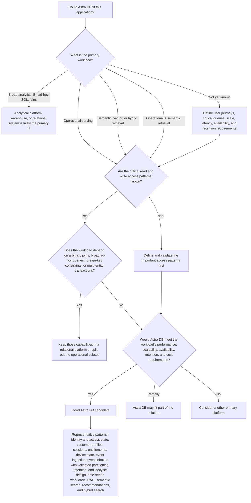
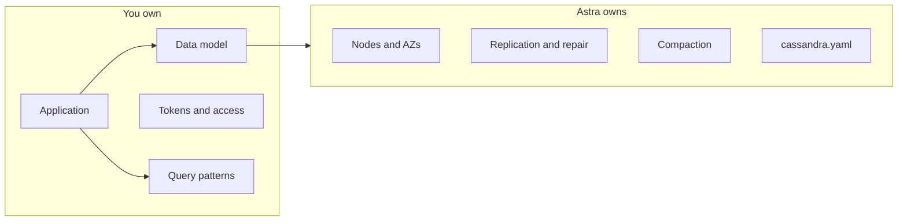

# 01 — Why Astra DB

This module answers:

1. What is Astra DB?
2. Why would I use it?
3. When should I use it?
4. When should I **not** use it?
5. How is it different from self-managed Cassandra?

## What is Astra DB?

**Astra DB Serverless** is a multi-cloud database-as-a-service built on Apache Cassandra. It is optimized for operational workloads that need large data volume, low latency, and flexible data models — including vector search. You get a production-ready database from the start: no cluster to build, and no Cassandra operational settings to tune. On-demand capacity **autoscales** with usage.

You do not provision nodes, pick a snitch, schedule repairs, or choose a compaction strategy. You spend time on the data model and the application.

There are two deployment types:

| Type | Use it for |
|---|---|
| **Serverless (vector)** | Operational data **and** vector search. Required for the Knowledge Search lab. |
| **Serverless (non-vector)** | Traditional tables only (profiles, sessions, events). |

This workshop uses a **Serverless (vector)** database so both tables and collections work in one place.

Source: [About Astra DB Serverless](https://docs.datastax.com/en/astra-db-serverless/get-started/astra-db-introduction.html).

## Should I use Astra DB?

The goal of this assessment is not to choose a schema, API, or application architecture. The goal is to determine whether Astra DB is a strong platform candidate for the workload. Decisions such as tables versus collections, partition keys, indexing, vector search, and application integration come later.

The examples after **Good Astra DB candidate** are representative patterns, not automatic approvals. Walk the questions for that workload.

Use Astra DB when you need scalable operational data serving, predictable low-latency access patterns, high availability, or semantic retrieval capabilities without operating Cassandra infrastructure.

| Strong fit | Consider another technology |
|---|---|
| Known keys: identity, profiles, sessions, inbox, ingest, time-series | Ad-hoc SQL, warehouses |
| Knowledge Search, semantic search, document search | |

A few joins are not a reason to reject Astra DB. Implement them in the data model and application (extra query tables, denormalization, dual-write). Join-centric systems and ad-hoc SQL as the product belong on a relational store or warehouse.

Need a deeper assessment of a named application? Use the [Astra DB Architect Guide](../ASTRA-DB-ARCHITECT-GUIDE.md). It covers workload qualification, representative patterns, and design review before you accept a model.

## How is Astra DB different from self-managed Cassandra?

| Topic | Self-managed Cassandra | Astra DB Serverless |
|---|---|---|
| Nodes, gossip, snitches | You | Platform |
| Replication | You choose | Replication factor **3**, across **three availability zones** in the region; not editable. See [database limits](https://docs.datastax.com/en/astra-db-serverless/databases/database-limits.html) |
| Compaction | You tune | Platform-managed **Unified Compaction Strategy (UCS)**. It unifies STCS and LCS, supports time-series, and is chosen for you — no compaction config. `WITH compaction`, `gc_grace_seconds`, and caching are [ignored](https://docs.datastax.com/en/astra-db-serverless/cql/develop-with-cql.html). |
| `CREATE KEYSPACE` in CQL | Yes | No — portal or DevOps API |
| `nodetool` / JMX | Daily tools | Not available, and not needed |
| Write CL `ONE` / `ANY` / `LOCAL_ONE` | Allowed | Disallowed |
| Data API | Not the product surface | Simpler application API for new development (this workshop). CQL drivers remain fully supported. |
| Capacity | Cluster size | On-demand or [PCU groups](https://docs.datastax.com/en/astra-db-serverless/administration/provisioned-capacity-units.html) (module 04) |

Astra DB still uses Cassandra’s data model. **Partitions, clustering, TTLs, and tombstones still matter.** What goes away is cluster administration.

## Shared responsibility (short)

- **You:** data, data model, application, tokens, access, deletion policy, DR *plan*
- **The service:** managed database software, virtual infrastructure, and **automatic backups**
- **The cloud provider:** physical datacenters

Source: [Shared responsibility model](https://docs.datastax.com/en/astra-db-serverless/shared-responsibility-model.html). There is no Cassandra admin track in this workshop, because that work is not yours.

## Check your understanding

Walk the assessment tree out loud for Identity, Event Inbox, or Knowledge Search. Say why a representative pattern is still not an automatic approval.

## Next

[02 — Astra fundamentals](../02-astra-fundamentals/astra-fundamentals.md)
