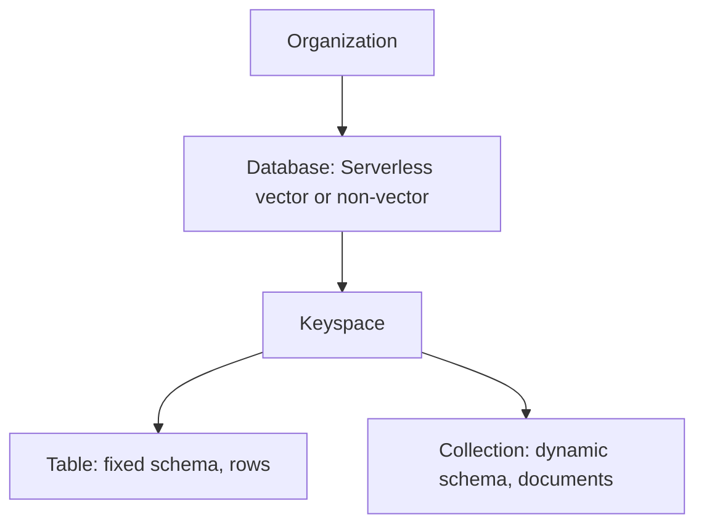

# 02 — Astra fundamentals

Vocabulary for every later lab. After this module you can name the objects you will create and the credentials you will use.

## The object model



| Term | Meaning |
|---|---|
| **Database** | The Astra resource you created in [module 00](../00-get-started/get-started.md). Region is chosen at create time. |
| **Keyspace** | A container for tables and collections. Created in the portal or DevOps API, **not** with CQL `CREATE KEYSPACE`. |
| **Table** | Fixed schema. Rows and columns. Best for structured, query-first data (identity, inbox). |
| **Collection** | Dynamic schema. Documents and fields. Best for semi-structured data and Knowledge Search. |
| **Row / document** | One stored item. |
| **Column / field** | One property of that item. |

Sources: [About Astra DB Serverless](https://docs.datastax.com/en/astra-db-serverless/get-started/astra-db-introduction.html), [Manage collections and tables](https://docs.datastax.com/en/astra-db-serverless/databases/manage-collections.html).

### Tables vs collections — pick on purpose

| Aspect | Tables | Collections |
|---|---|---|
| Schema | Fixed at create time | Dynamic per document |
| Access | Partition key + clustering (CQL or Data API) | Filters, sort, vector sort |
| Best for | Identity, inbox, anything query-first | Knowledge Search, flexible documents |
| Indexing | You index columns you filter | Selective indexing at **create** time; see [database limits](https://docs.datastax.com/en/astra-db-serverless/databases/database-limits.html) |

This workshop uses **tables for identity and inbox**, and a **collection for Knowledge Search**.

## Replication you cannot change

Each Astra DB Serverless database starts in **one primary region**. Inside that region, data is replicated across availability zones. Replication factor and strategy are **platform-controlled** — you cannot set them in CQL.

Writes are **eventually consistent** across replicas (and across regions, if you add regions). The Data API always uses **`LOCAL_QUORUM`**. CQL reads support all consistency levels. CQL writes support all consistency levels except `ONE`, `ANY`, and `LOCAL_ONE`.

Adding regions is a paid capability. Extra regions **replicate data**. Plan vector **query** capacity as single-region today — each vector PCU group is one unit (module 04).

Source: [Database limits](https://docs.datastax.com/en/astra-db-serverless/databases/database-limits.html#replicas-and-consistency).

## How you connect

| Path | Auth | This workshop |
|---|---|---|
| **Astra Portal** | Login | Explore data, CQL console |
| **Data API + clients** | API endpoint + application token | **Lab 2**, Java `astra-db-java` |
| **CQL console** | Portal session | **Lab 1** |
| **Cassandra drivers** | Secure Connect Bundle + token as password | Mentioned, not built |

Application tokens look like `AstraCS:...`. They are not bound to a specific driver. A Database Administrator token on one database is enough for the labs.

Sources: [Get started with the Data API](https://docs.datastax.com/en/astra-db-serverless/api-reference/dataapiclient.html), [Connection methods](https://docs.datastax.com/en/astra-db-serverless/databases/connection-methods-comparison.html).

## Portal check (not a lab)

Open your database:

1. Confirm type is **Serverless (vector)** and status is **Active**.
2. Note the region and the keyspace name.
3. Open **CQL console** and run:

```sql
DESCRIBE KEYSPACES;
```

You should see your keyspace. You will **not** see a Cassandra ring or `nodetool status`. That is the point.

## Common mistakes already

- Creating a **non-vector** database, then wondering why Lab 2 collections/vector fail
- Putting the token in git
- Assuming `CREATE KEYSPACE` in CQL will work
- Treating collections as “the new tables” for identity lookups — use a table when the query is a primary key

## Next

[03 — Data modelling](../03-data-modeling/data-modeling.md)
