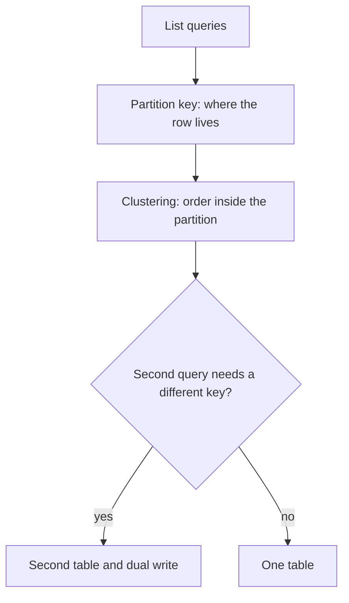

# 03 — Data modelling

This is the most important technical module. Astra DB will not save a relational schema.

After this module you start **[Lab 1 — Develop with CQL](../labs/lab-1-cql.md)** (part A: identity).

## Golden rule

Design **one table per query pattern**. If a pattern cannot be expressed as **known partition key + optional range on clustering columns**, you need another table, a different key, or a different store.

This is the same rule as Cassandra. It still applies because Astra DB still stores rows in partitions.

## Four-step process

1. **List access patterns** — For each one: read/write frequency, latency, and whether the caller knows the key.
2. **Choose the partition key** — The query must land on **one partition** (or a small, bounded set) and keys must distribute load.
3. **Define clustering columns** — Order and uniqueness **inside** the partition. Sort is fixed at `CREATE TABLE` time (`CLUSTERING ORDER BY`).
4. **Duplicate when keys diverge** — Two patterns that need two different partition keys become two tables. The application owns dual-write consistency.



## Primary key anatomy

```sql
PRIMARY KEY (user_id, event_time)
--           ^ partition   ^ clustering

PRIMARY KEY ((consumer_id, bucket), event_time, event_id)
--            ^ composite partition     ^ clustering
```

| Piece | Question it answers |
|---|---|
| **Partition key** | Which partition (and therefore which replicas) store this data? |
| **Clustering columns** | How are rows ordered and uniquely identified **inside** that partition? |

Composite partition keys use extra parentheses: `((consumer_id, bucket), ...)`.

## Use case 1 — Enterprise Identity Platform

Access patterns (write these down **before** CQL):

| # | Query | Known values |
|---|---|---|
| Q1 | Get profile | `user_id` |
| Q2 | Get entitlements for a user | `user_id` |
| Q3 | Get session | `session_id` |
| Q4 | Get user by email | `email` |

That is **four tables**, not one `users` table with secondary indexes as the hot path.

```sql
PRIMARY KEY (user_id)                          -- Q1 users_by_id
PRIMARY KEY (user_id, entitlement)             -- Q2 entitlements_by_user
PRIMARY KEY (session_id)                       -- Q3 sessions_by_id
PRIMARY KEY (email)                            -- Q4 users_by_email
```

Q4 is denormalisation: `users_by_email` stores `user_id` so “login by email” is a partition hit, not a cluster scan.

Sessions are short-lived. Give the table a **TTL** (`default_time_to_live`) rather than relying on a nightly delete job. Deletes and expired TTLs both create **tombstones** — see below.

You will create these tables in Lab 1 part A.

## Use case 2 — Event Inbox Pattern

Access patterns:

| # | Query | Known values |
|---|---|---|
| Q5 | Append an event for a consumer | `consumer_id`, `event_id`, time |
| Q6 | Read recent events for a consumer in a time window | `consumer_id`, window |
| Q7 | Ignore duplicates | same `event_id` for that consumer |

Design choices:

- **Idempotency:** include `event_id` in the primary key so a retry is the same row, not a second row.
- **Bucketing:** do **not** put all of a consumer’s history in one partition forever. Add a time bucket to the partition key, for example day: `(consumer_id, bucket)`.
- **Ordering:** `event_time DESC` so “latest first” is the on-disk order.
- **Retention:** `default_time_to_live` on the table (for example 7 days).

```sql
PRIMARY KEY ((consumer_id, bucket), event_time, event_id)
```

You will create this in Lab 1 part B (module 04), together with Astra DDL surprises.

## Partition health

These failure modes survive in Astra. The platform **warns on oversized partitions**.

| Problem | What it looks like | Mitigation |
|---|---|---|
| **Hot partition** | One key (one tenant, one “global” id) gets most traffic | Spread keys; add a hash or time bucket |
| **Wide partition** | One partition grows without bound | Bucket; TTL; archive |
| **Unbounded clustering** | `PRIMARY KEY (user_id, event_time)` forever | Bucket by day/hour |

Unhealthy partitions cause latency and tombstone scans. You cannot `nodetool compact` your way out of a bad key on Astra.

## TTL, deletes, and tombstones

A delete is a **write** of a tombstone. TTL expiry is the same idea: a marker that the data is gone.

Tombstones must be compacted away later. Warn and fail thresholds are platform-set. You **cannot** set `gc_grace_seconds` — that property is **ignored**.

Practical rules:

- Prefer **TTL** for sessions and inbox retention over mass `DELETE`.
- Do not use a list and `DELETE list[i]` — Astra disables read-before-write list index operations.
- Do not treat “we will compact more aggressively” as a design plan. You cannot choose compaction.

## Anti-patterns (still fatal)

| Anti-pattern | Why it hurts | Do this instead |
|---|---|---|
| One big relational table + `ALLOW FILTERING` | Coordinator scans | Table whose partition key matches the query |
| Secondary index as the **primary** lookup (“find user by email”) | Extra index path, limits, wrong mental model | `users_by_email` table |
| LWT (`IF NOT EXISTS`) on a hot partition | Extra round-trips, contention | Idempotent primary key |
| Unbounded partitions | Partition-size warnings, slow reads | Bucketing + TTL |
| Too many columns on one table | Hits table column limits | Split tables or frozen UDTs / collections |

SAI exists on Astra and is the right **secondary** index when you already have a partition key and need extra filters. It is **not** a substitute for query-first tables.

`ALLOW FILTERING` may work on a toy table. It is not a production access pattern.

Numeric guardrails (partition warnings, column counts, index budgets) are in [database limits](https://docs.datastax.com/en/astra-db-serverless/databases/database-limits.html).

## Modelling checklist

Before you ship a table:

- [ ] Every hot path is written as a query with **known** partition key values
- [ ] No partition grows forever
- [ ] Dual-write tables are named (`users_by_id` / `users_by_email`) so the application cannot “forget” the second write
- [ ] TTL is set where data should die (sessions, inbox)
- [ ] You are not depending on compaction settings or `gc_grace_seconds`

Knowledge Search is a **collection**, not a CQL primary key. It is taught in [module 06](../06-data-api-and-vector-search/data-api-and-vector-search.md).

## Lab

Open **[Lab 1 — Develop with CQL](../labs/lab-1-cql.md)** and complete **Part A (Identity)**.

Stop at Part B until you have read [module 04](../04-astra-specific-behavior/astra-specific-behavior.md).

## Next

[04 — Astra-specific behaviour](../04-astra-specific-behavior/astra-specific-behavior.md)
