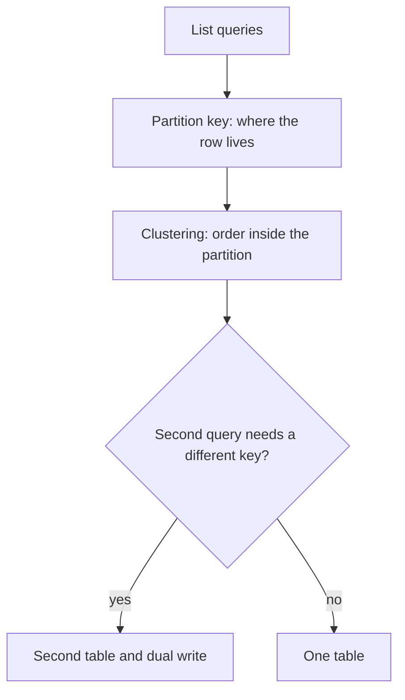
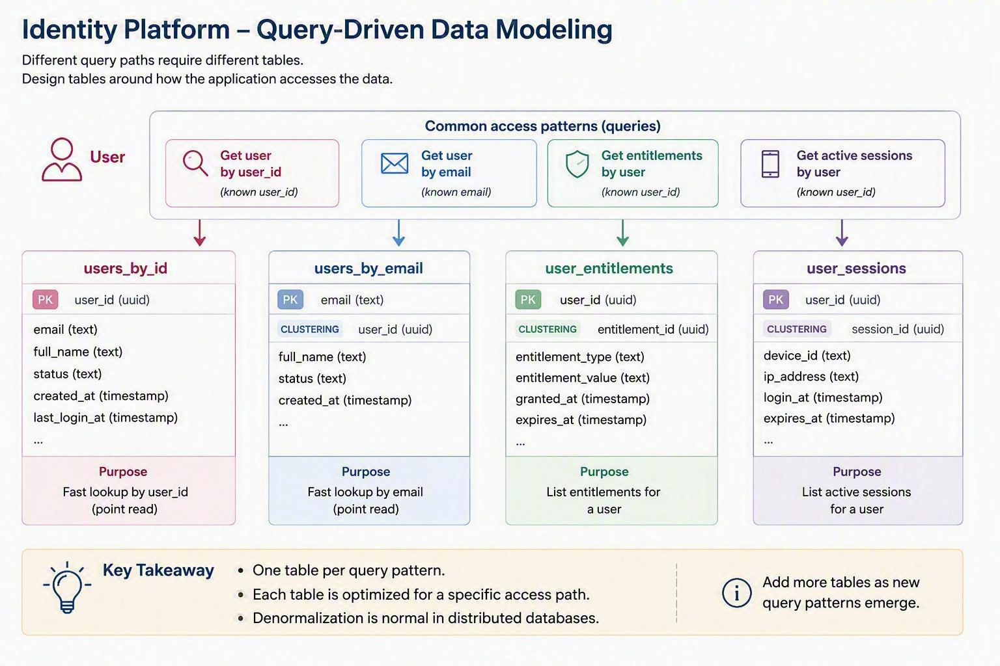
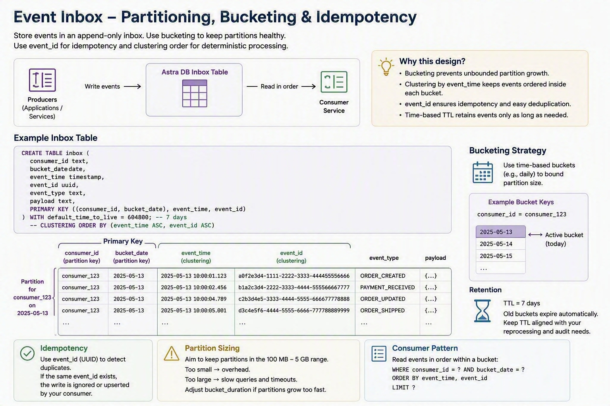

# 03 — Data modelling

This is the most important technical module. Astra DB will not save a relational schema.

If you have not yet qualified the application, start with the [Astra DB Architect Guide](../ASTRA-DB-ARCHITECT-GUIDE.md).

At the end of this page you create the identity tables in the CQL console.

## Golden rule

Design **one table per query pattern**. If a pattern cannot be expressed as **known partition key + optional range on clustering columns**, you need another table, a different key, or a different store.

This is the same rule as Cassandra. It still applies because Astra DB still stores rows in partitions.

## Four-step process

1. **List access patterns** — For each one: read/write frequency, latency, and whether the caller knows the key.
2. **Choose the partition key** — The query must land on **one partition** (or a small, bounded set) and keys must distribute load.
3. **Define clustering columns** — Order and uniqueness **inside** the partition. Sort is fixed at `CREATE TABLE` time (`CLUSTERING ORDER BY`).
4. **Duplicate when keys diverge** — Two patterns that need two different partition keys become two tables. The application owns dual-write consistency.



## Primary key anatomy

```sql
PRIMARY KEY (user_id, event_time)
--           ^ partition   ^ clustering

PRIMARY KEY ((consumer_id, bucket), event_time, event_id)
--            ^ composite partition     ^ clustering
```

| Piece | Question it answers |
|---|---|
| **Partition key** | Which partition (and therefore which replicas) store this data? |
| **Clustering columns** | How are rows ordered and uniquely identified **inside** that partition? |

Composite partition keys use extra parentheses: `((consumer_id, bucket), ...)`.

## Use case 1 — Enterprise Identity Platform



Access patterns (write these down **before** CQL):

| # | Query | Known values |
|---|---|---|
| Q1 | Get profile | `user_id` |
| Q2 | Get entitlements for a user | `user_id` |
| Q3 | Get session | `session_id` |
| Q4 | Get user by email | `email` |

That is **four tables**, not one `users` table with secondary indexes as the hot path.

```sql
PRIMARY KEY (user_id)                          -- Q1 users_by_id
PRIMARY KEY (user_id, entitlement)             -- Q2 entitlements_by_user
PRIMARY KEY (session_id)                       -- Q3 sessions_by_id
PRIMARY KEY (email)                            -- Q4 users_by_email
```

Q4 is denormalisation: `users_by_email` stores `user_id` so “login by email” is a partition hit, not a cluster scan.

Sessions are short-lived. Give the table a **TTL** (`default_time_to_live`) rather than relying on a nightly delete job. Deletes and expired TTLs both create **tombstones** — see below.

You will create these tables in the lab below.

## Use case 2 — Event Inbox Pattern



Access patterns:

| # | Query | Known values |
|---|---|---|
| Q5 | Append an event for a consumer | `consumer_id`, `event_id`, time |
| Q6 | Read recent events for a consumer in a time window | `consumer_id`, window |
| Q7 | Ignore duplicates | same `event_id` for that consumer |

Design choices:

- **Idempotency:** include `event_id` in the primary key so a retry is the same row, not a second row.
- **Bucketing:** do **not** put all of a consumer’s history in one partition forever. Add a time bucket to the partition key, for example day: `(consumer_id, bucket)`.
- **Ordering:** `event_time DESC` so “latest first” is the on-disk order.
- **Retention:** `default_time_to_live` on the table (for example 7 days).

```sql
PRIMARY KEY ((consumer_id, bucket), event_time, event_id)
```

You will create this in [module 04](../04-astra-specific-behavior/astra-specific-behavior.md), together with Astra DDL surprises.

## Partition health

These failure modes survive in Astra. The platform **warns on oversized partitions**.

| Problem | What it looks like | Mitigation |
|---|---|---|
| **Hot partition** | One key (one tenant, one “global” id) takes most reads and writes. The partition can be small and still hurt: that one replica set is the bottleneck. | Spread keys; add a hash or time bucket so traffic is not one partition |
| **Wide partition** | One partition keeps growing (rows, cells, tombstones). Reads slow down; Astra warns on oversized partitions. | Bucket; TTL; archive old buckets |
| **Unbounded clustering** | `PRIMARY KEY (user_id, event_time)` with no bucket: every event for that user lands in **one** partition forever. Clustering order does not cap size. | Put a day/hour bucket in the **partition** key: `((user_id, bucket), event_time)` |

Unhealthy partitions cause latency and tombstone scans. You cannot `nodetool compact` your way out of a bad key on Astra.

## TTL, deletes, and tombstones

A `DELETE` is a **write** of a tombstone **now**. That marker is **extra data** in the SSTable. Readers must scan it until compaction drops it.

A TTL on insert/update is **not** a tombstone. You write the **live cell** plus an expiry time. After expiry, **clients no longer see the data**. The expired cell is still the original payload sitting in the SSTable until compaction removes it — you did **not** add a delete marker at write time.

How much you delete changes what is written:

| Operation | CQL shape | On disk at write |
|---|---|---|
| Cell / row delete | `DELETE … WHERE pk = ? AND clustering = ?` | Tombstone (extra data) per cell or row |
| Whole partition | `DELETE FROM t WHERE pk = ?` (partition key only) | **One** partition tombstone covering that partition |
| TTL | `USING TTL` or table `default_time_to_live` | Live data with expiry — **no** tombstone |

A partition delete is much cheaper than deleting every clustering row. It still writes a tombstone **now**. For inbox/session **retention**, TTL is better: no delete job, no burst of tombstones. A partition delete is the right tool when you **mean** to drop a bucket (`DELETE FROM inbox_by_consumer WHERE consumer_id = ? AND bucket = ?`).

Expired cells and tombstones both leave SSTable data until compaction. Warn and fail thresholds are platform-set. You **cannot** set `gc_grace_seconds` — that property is **ignored**.

Practical rules:

- Prefer **TTL** for sessions and inbox retention over mass row `DELETE`. Mass row `DELETE` writes a tombstone per row (extra SSTable data) in one burst. TTL expires the live cells as they age — no tombstone at write. Compaction still has to drop expired cells. If you drop an **old time bucket** on purpose, use a **partition delete**, not one `DELETE` per event.
- Do not treat “we will compact more aggressively” as a design plan. You cannot choose compaction (UCS is platform-managed), `gc_grace_seconds` is ignored, and `nodetool` is not available. If tombstones hurt, change the model (TTL, buckets, partition delete of old buckets, no mass row delete).

## Anti-patterns (still fatal)

| Anti-pattern | Why it hurts | Do this instead |
|---|---|---|
| One big relational table + `ALLOW FILTERING` | Coordinator scans | Table whose partition key matches the query |
| Secondary index as the **primary** lookup (“find user by email”) | Extra index path, limits, wrong mental model | `users_by_email` table |
| LWT (`IF NOT EXISTS`) on a hot partition | Extra round-trips, contention | Idempotent primary key |
| Unbounded partitions | Partition-size warnings, slow reads | Bucketing + TTL |
| Too many columns on one table | Hits table column limits | Split tables or frozen UDTs / collections |

**SAI (Storage-Attached Index)** exists on Astra. Use it as a **secondary** filter **after** the query already hits a partition key (for example, `status` inside `user_id`). It is **not** a substitute for query-first tables: “find user by email” is still `users_by_email`, not an index on a users table. Index counts are limited — see [database limits](https://docs.datastax.com/en/astra-db-serverless/databases/database-limits.html). SAI reference: [CQL for Astra DB](https://docs.datastax.com/en/astra-db-serverless/cql/develop-with-cql.html#use-storage-attached-indexing-sai).

`ALLOW FILTERING` may work on a toy table. It is not a production access pattern.

Numeric guardrails (partition warnings, column counts, index budgets) are in [database limits](https://docs.datastax.com/en/astra-db-serverless/databases/database-limits.html).

## Modelling checklist

Before you ship a table:

- [ ] Every hot path is written as a query with **known** partition key values
- [ ] No partition grows forever
- [ ] Dual-write tables are named (`users_by_id` / `users_by_email`) so the application cannot “forget” the second write
- [ ] TTL is set where data should die (sessions, inbox)
- [ ] You are not depending on compaction settings or `gc_grace_seconds`

Knowledge Search is a **collection**, not a CQL primary key. It is taught in [module 06](../06-data-api-and-vector-search/data-api-and-vector-search.md).

## Lab — Enterprise Identity (CQL console)

Open your Serverless (vector) database → **CQL console**. Select your keyspace (often `default_keyspace`).

```sql
USE default_keyspace;
```

If your keyspace name differs, use that name everywhere below. If the console rejects a paste of several statements, run them one `CREATE TABLE` at a time.

### A1. Create query-first tables

```sql
CREATE TABLE IF NOT EXISTS users_by_id (
  user_id uuid PRIMARY KEY,
  email text,
  display_name text,
  status text,
  updated_at timestamp
);

CREATE TABLE IF NOT EXISTS entitlements_by_user (
  user_id uuid,
  entitlement text,
  granted_at timestamp,
  PRIMARY KEY (user_id, entitlement)
);

CREATE TABLE IF NOT EXISTS sessions_by_id (
  session_id uuid PRIMARY KEY,
  user_id uuid,
  created_at timestamp,
  last_seen timestamp
) WITH default_time_to_live = 86400
   AND comment = 'Identity sessions; TTL is one of the table properties Astra actually applies';

CREATE TABLE IF NOT EXISTS users_by_email (
  email text PRIMARY KEY,
  user_id uuid
);
```

```sql
DESCRIBE TABLE users_by_id;
```

Expected: each `CREATE TABLE` succeeds (or reports the table already exists). `DESCRIBE` shows `PRIMARY KEY (user_id)` and **no** clustering column. That is correct for Q1 (get profile by id).

### A2. Write and read one user

```sql
INSERT INTO users_by_id (user_id, email, display_name, status, updated_at)
VALUES (11111111-1111-1111-1111-111111111111, 'alex@example.com', 'Alex', 'active', toTimestamp(now()));

INSERT INTO users_by_email (email, user_id)
VALUES ('alex@example.com', 11111111-1111-1111-1111-111111111111);

INSERT INTO entitlements_by_user (user_id, entitlement, granted_at)
VALUES (11111111-1111-1111-1111-111111111111, 'invoice.read', toTimestamp(now()));

INSERT INTO entitlements_by_user (user_id, entitlement, granted_at)
VALUES (11111111-1111-1111-1111-111111111111, 'invoice.write', toTimestamp(now()));

INSERT INTO sessions_by_id (session_id, user_id, created_at, last_seen)
VALUES (22222222-2222-2222-2222-222222222222, 11111111-1111-1111-1111-111111111111, toTimestamp(now()), toTimestamp(now()));
```

Queries — each is a **single partition**:

```sql
SELECT * FROM users_by_id WHERE user_id = 11111111-1111-1111-1111-111111111111;

SELECT * FROM users_by_email WHERE email = 'alex@example.com';

SELECT * FROM entitlements_by_user WHERE user_id = 11111111-1111-1111-1111-111111111111;

SELECT * FROM sessions_by_id WHERE session_id = 22222222-2222-2222-2222-222222222222;
```

Expected: inserts report no rows. The four `SELECT`s return **one** profile (Alex), **one** email mapping, **two** entitlements (`invoice.read` and `invoice.write`), and **one** session.

### A3. Feel the anti-pattern (do not ship this)

```sql
SELECT * FROM users_by_id WHERE email = 'alex@example.com';
```

This fails without `ALLOW FILTERING` because `email` is not the partition key.

Expected: an error that the query might involve data filtering (not a row).

Now try:

```sql
SELECT * FROM users_by_id WHERE email = 'alex@example.com' ALLOW FILTERING;
```

Expected: Alex’s row on this tiny table. `ALLOW FILTERING` lets CQL scan and match a **non-key** column (here `email`). That scan hits every partition you read; it will not stay fast as the table grows. It is **not** a production path. The production path is `users_by_email`.

**Deliverable:** You can explain why identity is four tables, not one.

## Next

[04 — Astra-specific behaviour](../04-astra-specific-behavior/astra-specific-behavior.md)
