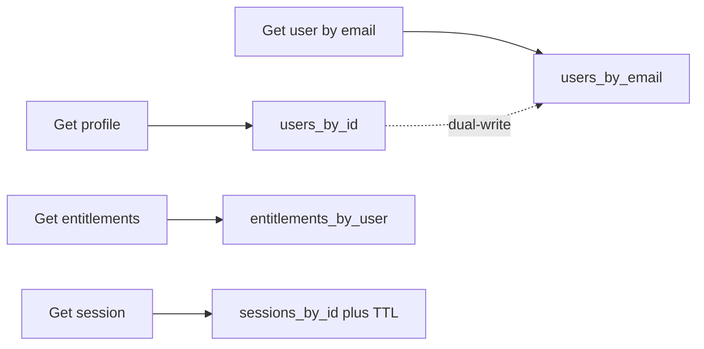
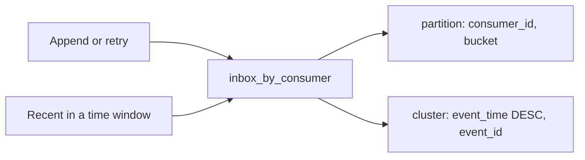
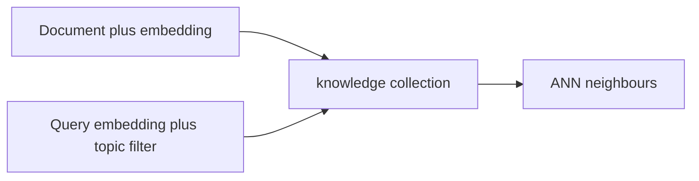

# Astra DB Architect Guide

Take-home. Not a workshop module. Not on the two-hour clock.

For architects, lead developers, application owners, and technical product owners. This guide answers three questions in one place:

1. Should Astra DB be investigated for this workload?
2. What could an appropriate Astra DB solution look like?
3. What must be reviewed before accepting the design?

Examples are representative patterns, not automatic approvals. The current store can be Oracle, PostgreSQL, SQL Server, MongoDB, DB2, or a custom system; the qualification questions are the same.

If the source is Oracle and migration-specific questions matter, use the separate [Oracle to Astra DB assessment](ORACLE-TO-ASTRA-ASSESSMENT.md). That handout is opportunity discovery, not a migration mandate.

---

## 1. How to use this guide

Stay on the workload first. Do not start with schema, APIs, or infrastructure.


Detailed table design and labs remain in [module 03](03-data-modeling/data-modeling.md). Score **paths**, not the whole estate as one result.

| Result | Meaning |
|---|---|
| **Strong candidate** | Access patterns are known, constraints do not block, and the workload can be shown to meet its requirements. |
| **Candidate with questions** | The category often fits, but lifecycle, mixed reporting, or application change still needs evidence. |
| **Split workload** | Some paths are operational; others are reporting, joins, or analytics. Score each path. |
| **Further assessment required** | Journeys, queries, identifiers, or success criteria are missing. |
| **Another platform preferred** | The primary value is analytics, ad-hoc SQL, arbitrary joins, or wide multi-entity transactions. |

A successful Astra DB workload usually has well-understood access patterns, clear lifecycle management, scalable partitioning opportunities, and measurable success criteria.

---

## 2. Workload qualification

### 2.1 Workload discovery

Write down what the application is for before listing queries.

- [ ] Purpose in one paragraph; users and channels named
- [ ] Three to five critical journeys listed
- [ ] Latency-sensitive and high-frequency operations marked
- [ ] Failure impact explicit
- [ ] Retention and deletion expectations known
- [ ] Operational serving, reporting, search, and analytics distinguished (they may need different stores)

If journeys and frequency are unknown, the outcome is **further assessment required**. Stop here and collect that information.

### 2.2 Access-pattern discovery

Astra DB evaluates applications by **access patterns**: production reads and writes, and the values known at request time.

For each hot path, name what is requested, what the caller already knows, how often it runs, and what “good” looks like.

- [ ] Top reads and writes listed
- [ ] Identifiers known at request time
- [ ] Frequency and latency-sensitive paths understood
- [ ] Success criteria defined (latency, throughput, availability, retention, cost)
- [ ] Reporting separated from operational serving

If the hot reads and writes cannot be listed, stop: **further assessment required**. Qualify before [data modelling](03-data-modeling/data-modeling.md).

| Journey | Typical known values | Pattern shape |
|---|---|---|
| Identity | `user_id` or `email` at login or lookup | Get current identity and access state by a known id |
| Customer profile | `customer_id` | Get or update one profile |
| Event ingestion | stream, device, or consumer id plus event id | Append at high rate; retries must not create duplicates |
| Exact document lookup | `document_id` | Get one document by id |
| Semantic search | query text plus a business filter (topic, tenant, source) | Retrieve similar items; not an id lookup |

These examples do not approve a platform choice.

### 2.3 Workload classification

Use this after discovery, not instead of it. **Workload category alone is never approval.** Typical fit means “worth investigating.”

| Workload | Typical fit | Comments |
|---|---|---|
| Identity and access | Strong candidate | Lookups by known principal or session |
| Customer profiles | Strong candidate | Direct get/update by customer id |
| Customer 360 / Subscriber 360 | Candidate with questions | Operational profile access may fit; cross-domain reporting and relationship discovery may require additional platforms |
| Session management | Strong candidate | Known session id; finite lifetime |
| Entitlements | Strong candidate | Current grants for a known principal |
| Device inventory | Strong candidate | Get by device id |
| Product catalogs | Candidate with questions | Get-by-key is operational; browse and merchandising may be mixed |
| Configuration data | Candidate with questions | Often small; justify with scale, availability, or access patterns |
| Event ingestion | Strong candidate | High write volume on known stream keys |
| Event history | Candidate with questions | Read windows and retention must be bounded |
| Event inbox | Candidate with questions | Requires a bounded working set and validated lifecycle |
| Telemetry | Candidate with questions | Ingestion may fit; dashboard SQL and unbounded history may not |
| Knowledge search / semantic retrieval / RAG | Strong candidate | Similarity-based retrieval. RAG uses this retrieval layer; generation remains in the application |
| Recommendations | Candidate with questions | Serving known features can fit; training and ad-hoc analysis usually do not |
| Operational + semantic retrieval | Strong candidate | Each access path should be assessed independently |
| Analytics / warehousing / ad-hoc reporting | Another platform likely preferred | Scans, historical SQL, or queries not known in advance |
| Join-centric applications | Another platform likely preferred | Arbitrary joins and multi-entity transactions on the hot path |

### 2.4 Positive signals and disqualifiers

Signals, not guarantees. They raise confidence only when access patterns and success criteria are written down. Disqualifiers are not a judgement of the existing design.

**Positive signals**

- Identifiers known at request time
- Predictable reads and writes
- Operational serving
- Horizontal growth is a real concern
- High ingest volume
- Explicit retention lifecycle
- Multi-region presence is a real requirement
- Semantic retrieval with filters

**Disqualifiers**

- Access patterns unknown
- Reporting or ad-hoc SQL is the primary workload
- Arbitrary joins are core functionality
- Broad multi-entity transactions are central
- Application logic cannot change
- Data cannot be duplicated or denormalized
- No practical way to bound the working set by identifier or time

A long list of signals with unknown queries is still **further assessment required**. A single disqualifier on one path does not fail the whole application; that is a **split workload**. If the product *is* the join, the report, or the multi-entity transaction, another platform is preferred.

### 2.5 Assessment outcome

Meanings are in [section 1](#1-how-to-use-this-guide). Before modelling, you need journeys, top reads and writes, known identifiers, and measurable success criteria.

| Result | Immediate action |
|---|---|
| **Strong candidate** | Continue with a representative pattern in [section 3](#3-representative-architectures). |
| **Candidate with questions** | Resolve open discovery questions before modelling. |
| **Split workload** | Score the operational subset again. Leave reporting and join-centric paths on the store that already serves them. |
| **Further assessment required** | Return to [discovery](#21-workload-discovery) and [access patterns](#22-access-pattern-discovery). A missing query list is not a platform decision. |
| **Another platform preferred** | Stop for that path. Do not start data modelling for it. |

---

## 3. Representative architectures

These are representative, customer-neutral patterns. They illustrate how a qualified workload may be shaped. They are not automatic approvals and do not replace workload-specific modelling.

Taught in the workshop: Identity in [modules 03](03-data-modeling/data-modeling.md) and [05](05-java-development/java-development.md); Event Inbox in modules 03 and [04](04-astra-specific-behavior/astra-specific-behavior.md); Knowledge Search in [module 06](06-data-api-and-vector-search/data-api-and-vector-search.md).

### 3.1 Enterprise Identity Platform

**Queries:** get profile by `user_id`; entitlements by `user_id`; session by `session_id`; user by `email`.

**Shape:** four tables, one per query. Dual-write `users_by_id` and `users_by_email`. TTL on sessions.



```sql
PRIMARY KEY (user_id)                          -- users_by_id
PRIMARY KEY (email)                            -- users_by_email
PRIMARY KEY (user_id, entitlement)             -- entitlements_by_user
PRIMARY KEY (session_id)                       -- sessions_by_id; plus default_time_to_live
```

**API:** CQL or Data API tables. Not a collection. Not a secondary-index “users” table.

**Avoid:** `ALLOW FILTERING` on email; LWT on a hot user id; unbounded session rows without TTL.

Detailed modelling and the identity lab: [module 03](03-data-modeling/data-modeling.md).

### 3.2 Event Inbox Pattern

**Queries:** append for a consumer; read recent events in a time window; ignore duplicate `event_id`.

**Shape:** composite partition `(consumer_id, bucket)`, clustering `event_time, event_id`, table TTL.



```sql
PRIMARY KEY ((consumer_id, bucket), event_time, event_id)
-- CLUSTERING ORDER BY (event_time DESC, event_id ASC)
-- plus default_time_to_live
```

**API:** CQL or Data API tables. High ingest, idempotent primary key.

**Avoid:** one partition per consumer forever; tuning `compaction` / `gc_grace_seconds` — Astra [ignores](https://docs.datastax.com/en/astra-db-serverless/cql/develop-with-cql.html) them silently (the DDL succeeds and the table is created, but the setting is discarded); `ALLOW FILTERING` on payload as the hot path.

This pattern is not an automatic fit. Validate partitioning, retention, ordering, deduplication, backlog (the intended read window), and lifecycle for the real workload.

Inbox DDL and Astra-specific behaviour: [module 04](04-astra-specific-behavior/astra-specific-behavior.md).

### 3.3 Knowledge Search

**Queries:** “documents like this text, in this topic/source.” Similarity, not an id lookup.

**Shape:** vector-enabled **collection** (tables can hold vectors; collections are the workshop surface). Metadata fields for filters (`topic`, `source`). Same embedding model on write and query. ANN + metadata filter together.



**API:** Data API (`astra-db-java` in this workshop).

**Constraints today:** plan vector **queries** as single-region. Extra regions can replicate documents; they do not add another vector PCU. A Serverless (vector) PCU group is **one unit**. Prefer Cache optimized. See [plan PCU groups](https://docs.datastax.com/en/astra-db-serverless/administration/plan-pcu.html) and [vector search](https://docs.datastax.com/en/astra-db-serverless/databases/vector-search.html).

**Avoid:** using Knowledge Search to fetch `user_id`; exact KNN; treating extra regions as vector-query failover; embedding with two different models.

Implementation lab: [module 06](06-data-api-and-vector-search/data-api-and-vector-search.md). Limits that size these designs (indexes, collections, partition warnings, rate limits) are not copied here. Use [database limits](https://docs.datastax.com/en/astra-db-serverless/databases/database-limits.html).

---

## 4. Architecture review checklist

Use this after qualification, a representative shape, and [data modelling](03-data-modeling/data-modeling.md). Numeric quotas live on [database limits](https://docs.datastax.com/en/astra-db-serverless/databases/database-limits.html).

### 4.1 Workload fit

- [ ] Every hot path is a known access pattern, not ad-hoc SQL or joins
- [ ] Each hot query can hit **one partition** (or a small, bounded set)
- [ ] RF and compaction strategy cannot be set; `cassandra.yaml`, UDFs, and materialized views are not available on Astra
- [ ] CQL write consistency `ONE`, `ANY`, and `LOCAL_ONE` are not supported; use `LOCAL_QUORUM` or higher
- [ ] Vector search, if any, is **ANN + metadata**, not exact KNN

### 4.2 Data model and lifecycle

> **Delete mechanics matter here.** In Astra DB (Cassandra), a `DELETE` is a **write** — it creates a tombstone marker in the SSTable that persists until compaction. A mass row-delete job generates one tombstone per row and can accumulate faster than compaction removes them. `TTL`, by contrast, does not write a tombstone at insert time; it writes the live cell with an expiry timestamp. After expiry the client stops seeing the data; the cell is cleaned up by compaction. Use TTL for natural expiry (sessions, inbox retention). Use a partition delete to intentionally drop an old time bucket. Avoid mass row deletes as a recurring operational pattern.

- [ ] No partition grows forever; hotspot risk is named and mitigated
- [ ] Retention is explicit (TTL and/or bounded windows)
- [ ] Deletes are intentional (TTL for expiry; partition delete for a bucket), not a mass row-delete job as the design
- [ ] Writes that must be retries are idempotent
- [ ] Ordering requirements are met by clustering or by the application, not by an after-the-fact sort of an unbounded set
- [ ] Duplicate handling is defined (primary key or an explicit business rule)
- [ ] Application-managed denormalization and dual-writes are named so a second write cannot be forgotten

### 4.3 Enterprise Identity

- [ ] One table per query (`users_by_id`, `users_by_email`, `entitlements_by_user`, `sessions_by_id`)
- [ ] Application **dual-writes** `users_by_id` and `users_by_email`
- [ ] Sessions use table TTL; they are not unbounded
- [ ] Email lookup is not `ALLOW FILTERING` or an SAI index as the primary lookup path — it is a separate `users_by_email` table
- [ ] SAI is appropriate as a secondary predicate filter within a known partition (e.g. filtering `status` inside `user_id`); it is not a substitute for a query-first table
- [ ] Identity is **tables**, not a collection

### 4.4 Event Inbox

- [ ] `event_id` is in the primary key so retries are idempotent
- [ ] Partition key includes a **time bucket** (`consumer_id`, `bucket`)
- [ ] Table TTL covers retention
- [ ] The intended read window matches retention and bucket size (backlog is bounded)
- [ ] Lifecycle (append, retry, expire) is validated for this consumer
- [ ] You are not depending on `compaction` or `gc_grace_seconds` (Astra ignores them)

### 4.5 Knowledge Search

- [ ] Collection (or vector table) stores embeddings with metadata filters
- [ ] Insert and query use the **same** embedding model
- [ ] Reads are ANN **with** a metadata filter, not an id lookup
- [ ] Vector **query** capacity is planned as single-region (extra regions can replicate data; they do not add a vector PCU)
- [ ] Serverless (vector) PCU group is **one unit** if you use PCUs; prefer Cache optimized

### 4.6 Platform

- [ ] Keyspaces are created in the portal or DevOps API, not with CQL `CREATE KEYSPACE`
- [ ] DDL warnings are treated as real (`WITH` properties that Astra ignores)
- [ ] Data API reads and writes are assumed `LOCAL_QUORUM`
- [ ] Design is checked against current [database limits](https://docs.datastax.com/en/astra-db-serverless/databases/database-limits.html), not a copied quota table

---

## 5. Next steps

- Detailed table modelling and lab guidance: [03 Data modelling](03-data-modeling/data-modeling.md)
- Astra-specific behaviour and limitations: [04 Astra-specific behaviour](04-astra-specific-behavior/astra-specific-behavior.md)
- Vector and Data API implementation: [06 Data API and vector search](06-data-api-and-vector-search/data-api-and-vector-search.md)
- Migrating from Oracle: [Oracle to Astra DB assessment](ORACLE-TO-ASTRA-ASSESSMENT.md)
