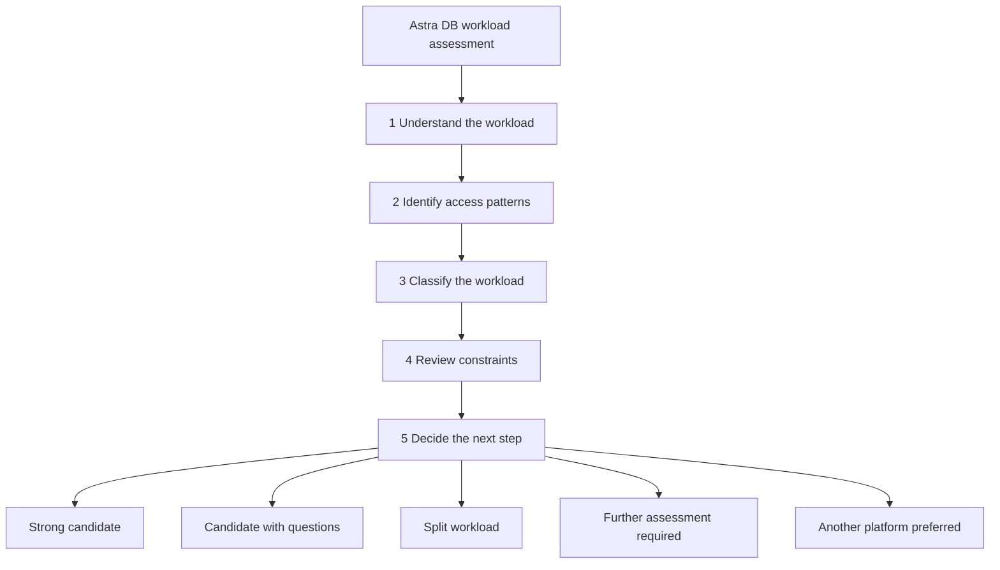

# Astra DB Workload Assessment

Take-home. Not a workshop module. Not on the two-hour clock.

This guide helps determine whether Astra DB should be considered for a workload. Representative use cases are examples, not approvals. Astra DB suitability depends on workload characteristics.

Use it when an architect, lead developer, or application owner has named an application and asks: **how do I systematically evaluate whether Astra DB is worth considering?**

The current store can be Oracle, PostgreSQL, SQL Server, MongoDB, DB2, or a custom system. The questions are the same.

Repository path:

[Why Astra DB](01-why-astra-db/why-astra-db.md) → **Workload Assessment** (this document) → [Oracle Assessment](ORACLE-TO-ASTRA-ASSESSMENT.md) (if the source is Oracle) → [Reference architectures](reference-architectures/reference-architectures.md) → [Data modelling](03-data-modeling/data-modeling.md) → [Architecture review](ARCHITECTURE-REVIEW-CHECKLIST.md)

---

## 1. Assessment process

Work in this order. Stay on the workload: what the application must do, who it serves, and how it is accessed. Do not start with schema, APIs, or infrastructure.

A mixed application is normal. Score **paths**, not the whole estate as one result. Record the result in [Typical assessment outcomes](#5-typical-assessment-outcomes).

---

## 2. Workload discovery

Write down what the application is for before listing queries.

- What does the application do?
- Who uses it?
- What are the critical user journeys?
- Which operations are latency sensitive?
- Which actions occur most frequently?
- What business capability would fail without this application?
- What data has retention requirements?
- What operational, reporting, or search requirements exist?

### Discovery checklist

- [ ] The application’s purpose is stated in one paragraph
- [ ] Primary users and channels are named
- [ ] The three to five journeys that matter most are listed
- [ ] Latency-sensitive operations are marked
- [ ] High-frequency operations are marked
- [ ] The failure impact of this application is explicit
- [ ] Retention and deletion expectations are known
- [ ] Operational serving, reporting, and search are distinguished (they may need different stores)

If journeys and frequency are unknown, the outcome is **further assessment required**. Stop here and collect that information.

---

## 3. Access pattern discovery

Astra DB evaluates applications by **access patterns**: the reads and writes that must succeed in production, with the values the caller already has.

A pattern is usable when the team can say, for each hot path: what is requested, what is known at request time, how often it runs, and what “good” looks like (latency, freshness, durability, retention).

### Access-pattern checklist

- [ ] The top reads can be listed
- [ ] The top writes can be listed
- [ ] Identifiers for those paths are known at request time
- [ ] Latency-sensitive paths are understood
- [ ] Success criteria can be defined (latency, throughput, availability, retention, cost)
- [ ] Reporting can be separated from operational serving

If the team cannot list the hot reads and writes, the outcome is **further assessment required**. Qualify the workload before engaging in data modelling.

### Examples (illustrative)

| Journey | Typical known values | Pattern shape |
|---|---|---|
| Identity | `user_id` or `email` at login or lookup | Get current identity and access state by a known id |
| Customer profile | `customer_id` | Get or update one profile |
| Event ingestion | stream, device, or consumer id plus event id | Append at high rate; retries must not create duplicates |
| Document retrieval | `document_id` | Get one document by id |
| Semantic search | query text plus a business filter (topic, tenant, source) | Retrieve similar items; not an id lookup |

These examples do not approve a platform choice. Walk the checklists for the real workload.

---

## 4. Workload classification matrix

Use this after discovery, not instead of it. **Workload category alone is never sufficient.**

| Workload | Typical fit | Comments |
|---|---|---|
| Identity and access | Strong candidate | Lookups by known principal or session |
| Customer profiles | Strong candidate | Get and update by customer id |
| Customer 360 / Subscriber 360 | Candidate with questions | Operational lookup and profile access often fit. Cross-domain reporting, analytics, and relationship discovery often require additional platforms. |
| Session management | Strong candidate | Known session id; finite lifetime |
| Entitlements | Strong candidate | Current grants for a known principal |
| Device inventory | Strong candidate | Get by device id |
| Product catalogs | Candidate with questions | Get-by-key is operational; browse, facet, and merchandising may be mixed |
| Configuration data | Candidate with questions | Often small; justify Astra DB with scale, availability, or access-pattern needs |
| Event ingestion | Strong candidate | High write volume on known stream keys |
| Event history | Candidate with questions | Read windows and retention must be bounded |
| Event inbox | Candidate with questions | Needs a bounded working set plus validated retention and lifecycle design |
| Telemetry | Candidate with questions | Ingest often fits; unbounded history and dashboard SQL often do not |
| Knowledge search | Strong candidate | Similarity plus metadata filters |
| Semantic retrieval | Strong candidate | Retrieve by meaning, usually with a scope filter |
| RAG | Strong candidate | The retrieval slice; generation stays in the application |
| Recommendations | Candidate with questions | Serving known features can fit; training and ad-hoc analysis usually do not |
| Operational + semantic retrieval | Strong candidate | Operational lookup and semantic retrieval coexist. Evaluate each access path independently. |
| Analytics | Another platform likely preferred | Scans, aggregations, and changing questions |
| Warehousing | Another platform likely preferred | Historical SQL is the product |
| Ad-hoc reporting | Another platform likely preferred | The query is not known in advance |
| Join-centric applications | Another platform likely preferred | Arbitrary joins and multi-entity transactions on the hot path |

Typical fit means “worth investigating,” not “approved.”

---

## 5. Typical assessment outcomes

| Result | Meaning | Typical next step |
|---|---|---|
| **Strong candidate** | Access patterns are known, constraints do not block, and the workload can be shown to meet its requirements. | Confirm fit in [Why Astra DB](01-why-astra-db/why-astra-db.md). If the source is Oracle, continue with the [Oracle to Astra DB assessment](ORACLE-TO-ASTRA-ASSESSMENT.md). Then [reference architectures](reference-architectures/reference-architectures.md), [data modelling](03-data-modeling/data-modeling.md), and the [architecture review checklist](ARCHITECTURE-REVIEW-CHECKLIST.md). |
| **Candidate with questions** | The category often fits, but lifecycle, mixed reporting, or application change still needs evidence. | Stay on the discovery and access-pattern checklists. Use [Why Astra DB](01-why-astra-db/why-astra-db.md) to walk the fit questions. Do not start modelling until the open questions have owners. |
| **Split workload** | Some paths are operational; others are reporting, joins, or analytics. | Score each path. The operational subset may be a strong candidate or a candidate with questions. Leave reporting and join-centric paths on the store that already serves them. |
| **Further assessment required** | Journeys, queries, identifiers, or success criteria are missing. | Complete [workload discovery](#2-workload-discovery) and [access pattern discovery](#3-access-pattern-discovery). A missing query list is not a platform decision. |
| **Another platform preferred** | The primary value of the system is analytics, ad-hoc SQL, arbitrary joins, or wide multi-entity transactions. | Stop. [Why Astra DB](01-why-astra-db/why-astra-db.md) records the non-fit. Do not start data modelling for that path. |

---

## 6. Common disqualifiers

These are frequent reasons Astra DB is **not** the primary store for that path. They are not a judgement of the existing design.

- Access patterns are unknown
- Reporting or ad-hoc SQL is the primary workload
- Arbitrary joins are core functionality
- Multi-entity transaction boundaries are central to the application
- Application logic cannot change
- Data cannot be duplicated or denormalized
- There is no practical way to bound the working set by identifier or time

A single disqualifier on one path does not fail the whole application. That is a **split workload**. If the product *is* the join, the report, or the multi-entity transaction, another platform is preferred.

---

## 7. Common positive signals

Signals, not guarantees. They raise confidence only when access patterns and success criteria are written down.

- Identifiers are known at request time
- The workload is operational serving
- Read paths are predictable
- Write paths are predictable
- Horizontal growth is a real concern
- Multi-region presence is a real requirement
- Ingest volume is high
- Data has a defined retention lifecycle
- Semantic retrieval is a requirement (similarity plus filters)

A long list of signals with unknown queries is still **further assessment required**.

---

## 8. What to do next

After this document:

Fit tree (if you have not walked it): [01 Why Astra DB](01-why-astra-db/why-astra-db.md).

| Step | Document |
|---|---|
| Fit (workshop tree) | [01 Why Astra DB](01-why-astra-db/why-astra-db.md) |
| Oracle source system (optional) | [Oracle to Astra DB assessment](ORACLE-TO-ASTRA-ASSESSMENT.md) |
| Example shapes | [Reference architectures](reference-architectures/reference-architectures.md) |
| Schema from named queries | [03 Data modelling](03-data-modeling/data-modeling.md) |
| Production validation | [Architecture review checklist](ARCHITECTURE-REVIEW-CHECKLIST.md) |

Collect this before data modelling: the journeys, the top reads and writes, the identifiers known at request time, and measurable success criteria (scale, latency, availability, consistency, retention, cost).

A successful Astra DB workload is usually characterized by well-understood access patterns, clear lifecycle management, scalable partitioning opportunities, and measurable success criteria.
