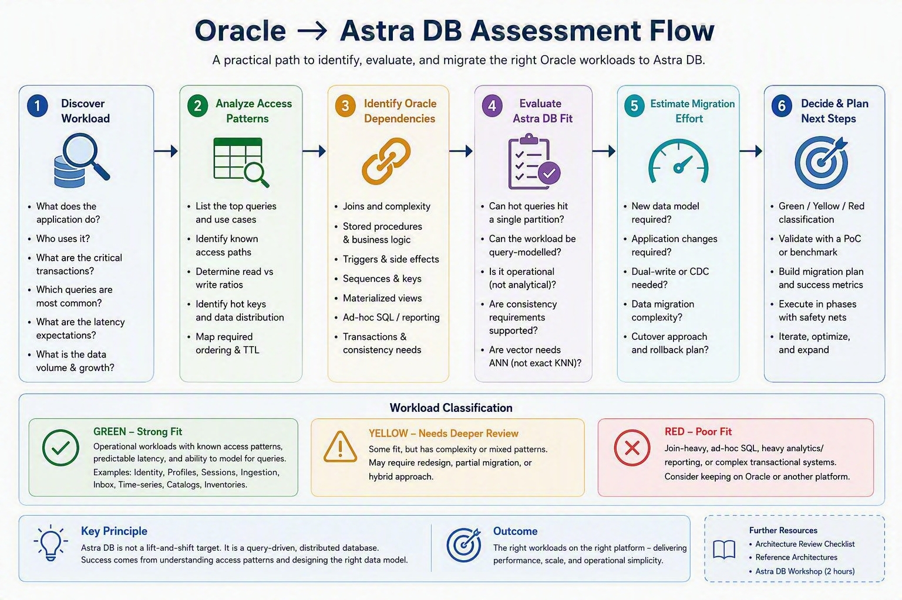

# Oracle to Astra DB assessment

Take-home. Not a workshop module. Not on the two-hour clock.

Use this when an existing Oracle application is on the table and you need to decide whether **any part of it** is a strong Astra DB candidate. It is opportunity discovery, not a migration mandate.

Oracle remains a strong fit for many relational, transactional, and reporting workloads. Astra DB is a strong fit for **query-first operational data** — known access patterns, predictable latency, high write throughput, and horizontal scale — without operating a cluster.

The question is not “should we replace Oracle?” The question is:

**How do I identify Oracle workloads that are good Astra DB candidates?**

If you are evaluating a workload independent of a source platform, use the [Astra DB Architect Guide](ASTRA-DB-ARCHITECT-GUIDE.md). Use this document when the workload already runs on Oracle and migration questions must be addressed.

---

## 1. Why this document exists

Many organizations run Oracle applications that were designed years ago. The schema, stored procedures, and reports grew around that model. Some of those workloads still need a relational engine. Some of them are already **lookup, ingest, session, or search** problems wearing an ER diagram.

The goal is not to migrate everything.

The goal is to find workloads that benefit from:

- query-first access patterns
- predictable low latency
- high write throughput
- horizontal scale
- global distribution
- operational simplicity (no cluster to run)

If those properties matter and the hot paths can be named, Astra DB is worth a serious look. If they do not, keep the workload where it is strong.

---

## 2. The five-step assessment

Work the steps in order. Stop when the answer is clearly “not this workload” — that is a successful assessment.

### Step 1 — Understand the workload

- What does the application do?
- Who uses it?
- What are the critical transactions?
- Which queries happen most often in production telemetry, not only in the schema documentation?
- What are the latency-sensitive operations?

You are looking for **operational** traffic: logins, profile reads, session create, event append, catalog get-by-id. You are not yet looking at tables or Oracle features.

### Step 2 — Understand the data access patterns

- Can the main queries be listed?
- Which identifiers are known at query time (`user_id`, `session_id`, `sku`, `device_id`, `consumer_id`)?
- What are the most common reads?
- What are the most common writes?

If the team cannot list the hot queries, they are not ready to model for Astra. Define access patterns first. Astra (and Cassandra) design **tables from queries**, not from an ER diagram.

### Step 3 — Identify Oracle dependencies

Which of these does the workload actually need?

- Heavy joins across many tables on the hot path
- Stored procedures as the system of record for business rules
- Triggers that maintain other tables
- Sequences as the only identity scheme
- Materialized views for read models
- Broad multi-table transactions
- Ad-hoc reporting in the same database
- Analytics / warehouse-style scans

These are not defects. They are **relational strengths**. They also tell you how much of the design would move into the application and into extra query tables on Astra.

### Step 4 — Evaluate Astra fit

- Can the access patterns be modelled as one table (or collection) per query?
- Can each hot query target a **partition key** (or a small, bounded set of partitions)?
- Is predictable low-latency access important?
- Is this **operational data** rather than reporting data?
- Would high write throughput or multi-region presence help this workload?

If yes, this is a candidate. Platform caveats (consistency, ignored table properties, vector capacity) belong in a design review after the target model exists, not in this screen. The [Astra DB Architect Guide](ASTRA-DB-ARCHITECT-GUIDE.md) has that review.

### Step 5 — Estimate migration effort

- Is a new data model required? (Almost always yes if the Oracle model is join-centric.)
- Are application changes required? (Usually yes: the app owns dual-writes, identifiers, and what used to live in procedures and triggers.)
- Is dual-write needed during cutover?
- Is data migration straightforward once the **target** model exists?

Moving rows is rarely the hard part. **Naming the queries and designing keys** is.

Before committing to migration, agree on four proof points:

- **Business correctness:** priority queries return equivalent business results.
- **Performance:** representative workload tests meet the agreed latency and throughput objectives.
- **Resilience:** retries, duplicate events, temporary failures, and recovery behave correctly.
- **Economics:** expected Astra consumption and one-time modernisation effort support the business case.

---

## 3. Workload traffic light

Use this after steps 1–4. Mix is normal: one Oracle database can hold a green operational path and a red reporting path. Split them in the conversation; do not score the whole estate as one colour.

### Example Astra opportunity candidates

Common enterprise and telecommunications workloads include:

- Identity platform
- Customer profile store
- Session management
- Customer entitlements
- Device inventory
- Event processing
- Service inventory
- Product catalog

These workloads often have:

- known access patterns
- predictable read/write paths
- high operational value
- natural partition keys
- limited need for ad-hoc SQL

They are frequently strong candidates for further Astra DB assessment.

| | Typical workloads | Why |
|---|---|---|
| **Green — strong Astra candidates** | Identity platforms; customer profiles; session stores; product catalogs (get by key); customer state; event ingestion; event inbox; IoT and telemetry; knowledge search; document / semantic search | Hot paths use **known identifiers**. Reads and writes are operational. Denormalization is natural. Latency, ingest, and scale matter more than ad-hoc SQL. These match Astra’s query-first tables and, where needed, vector search. |
| **Yellow — needs deeper assessment** | Moderate joins on some paths; mixed operational and reporting usage; significant reporting in the same schema; existing integration or batch jobs that assume SQL | Part of the workload may be green. Reporting, joins, or integrations may need to **stay on Oracle** (or move to a warehouse) while lookup/ingest paths move. Assess query by query, not database by database. |
| **Red — usually not an Astra candidate** | Data warehouses; reporting platforms; heavy ad-hoc SQL; join-centric applications; complex OLTP with wide transaction boundaries | Astra is not a warehouse and not a general SQL engine. If the value of the system is joins, reports, or multi-table ACID as the product, keep a relational store. That is the right tool, not a failed Astra migration. |

Green does not mean “lift and shift the Oracle schema.” It means **the access pattern** is one Astra is built for, after query-first modelling.

---

## 4. Oracle to Astra mapping

This is a mindset shift, not a feature-for-feature port.

| Oracle concept | Astra thinking |
|---|---|
| Tables shaped by entities and 3NF | **Query-driven tables** — one table per access pattern |
| Joins on the read path | **Denormalization and duplication** — the application writes the same facts into the tables that will be read |
| Materialized views | **Additional query tables** (Astra does not use Oracle or Cassandra materialized views as the design tool) |
| Stored procedures | **Application logic** (Java, services) |
| Triggers | **Application events** or explicit dual-writes |
| Sequences | **UUIDs and application identifiers** |
| Foreign keys | Parent key **copied** onto child rows; integrity is an application concern |
| Ad-hoc `SELECT` / reporting | A **warehouse or relational replica** — not the Astra hot path |
| One database for OLTP and reports | Split: operational data on Astra; analytics where SQL is the product |

The storage engine is still wide-row / partition oriented. **You** own the data model, dual-writes, and TTLs. The service owns nodes, repair, and compaction. See [Why Astra DB](01-why-astra-db/why-astra-db.md).

---

## 5. Common migration surprises

- **Data migration is easier than data modelling.** Export/import is a project. Getting the partition keys right is the architecture.
- **Query patterns matter more than ER diagrams.** Start from the top ten queries, not from `USER` / `ORDER` / `ORDER_LINE`.
- **One table per access pattern.** Two ways to find a user (`id` vs `email`) is two tables and a dual-write, not one table plus an index as the hot path.
- **Partition design matters.** Unbounded partitions (all events for one customer forever) will hurt. Bucket time-series and inboxes.
- **Reporting often belongs somewhere else.** Do not force dashboards onto Astra because the operational data moved.
- **Application ownership increases.** Procedures, triggers, and FKs become code. That is expected, not a regression, if the payoff is latency and scale.
- **Cassandra-style thinking is different from relational thinking.** Same business facts; different shape. Architects who skip this step recreate Oracle in CQL and then struggle.

- **Choose migration tooling only after defining the target model.** Oracle-to-Astra is not a Cassandra rehosting exercise. Cassandra-family ZDM and SSTable migration tools do not automatically convert an Oracle schema, joins, or PL/SQL into an Astra model.

Worked shapes for identity, inbox, and knowledge search, and the final design review: [Astra DB Architect Guide](ASTRA-DB-ARCHITECT-GUIDE.md).

#### What a feasible migration usually looks like

A successful Oracle-to-Astra migration is normally an application-modernisation path, not a schema export/import:

1. Identify one bounded operational workload.
2. Design the Astra model from its priority queries.
3. Prototype and validate correctness and performance.
4. Backfill target-shaped data and keep changes synchronized where required.
5. Compare Oracle and Astra results before progressively moving traffic.
6. Keep a defined rollback path until Astra is accepted as authoritative.

The exact synchronization approach can be batch, application dual-write, CDC, or a combination. Select it only after the target Astra model is defined.

---

## 6. Fast screening checklist

Ten yes/no questions. Use them in a discovery call. You do not need a perfect score.

- [ ] Can the top 10 queries be listed?
- [ ] Are identifiers for those queries known at request time?
- [ ] Can reads be routed by those identifiers (not by joining to find the key)?
- [ ] Can the workload tolerate denormalization and duplicate writes?
- [ ] Is the workload **operational** rather than analytical?
- [ ] Is predictable low latency important on the hot path?
- [ ] Is high write throughput or ingest volume a real requirement?
- [ ] Would horizontal scale or presence in more than one region help?
- [ ] Can reporting stay on Oracle or move to a warehouse, rather than live on the same access path?
- [ ] Can the team change the application (model, dual-write, identifiers) as part of the move?

**Mostly yes** → strong Astra candidate. Continue with a query-first model ([module 03](03-data-modeling/data-modeling.md)) and the review in the [Astra DB Architect Guide](ASTRA-DB-ARCHITECT-GUIDE.md).

**Mostly no** → not a forced fit. Either split out a green slice, or keep the workload on Oracle and look for a better candidate elsewhere in the estate.

---

## 7. Next steps

Representative architectures and design review: [Astra DB Architect Guide](ASTRA-DB-ARCHITECT-GUIDE.md). Detailed table modelling: [03 Data modelling](03-data-modeling/data-modeling.md). Numeric quotas: [database limits](https://docs.datastax.com/en/astra-db-serverless/databases/database-limits.html).

Do not start with a full-schema dump. Start with one green workload, name the queries, and design the Astra tables (or collection) for those queries. Leave reporting and join-centric OLTP on the engine that already does them well.
