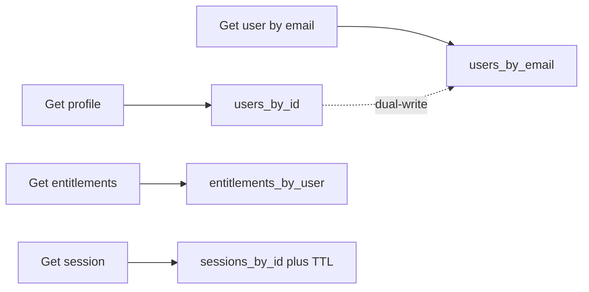
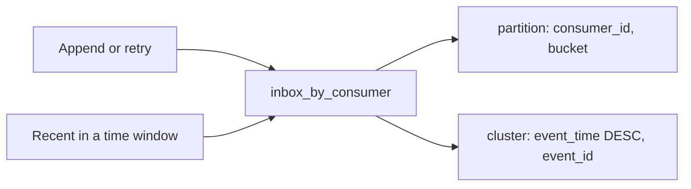
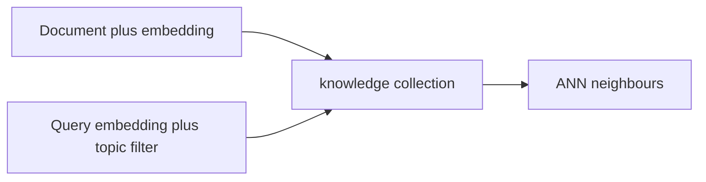

# Reference architectures

Take-home one-pager. Not a timed workshop module. Use it after [the decision tree](../01-why-astra-db/why-astra-db.md). After a design review, use the [architecture review checklist](../ARCHITECTURE-REVIEW-CHECKLIST.md).

Three customer-neutral patterns. No extra labs.

| Pattern | Taught in |
|---|---|
| Enterprise Identity Platform | Module 03, Lab 1A, Lab 2A |
| Event Inbox Pattern | Module 03, Lab 1B |
| Knowledge Search | Module 06, Lab 2B |

---

## Enterprise Identity Platform

**Queries:** get profile by `user_id`; entitlements by `user_id`; session by `session_id`; user by `email`.

**Shape:** four tables, one per query. Dual-write `users_by_id` and `users_by_email`. TTL on sessions.



```sql
PRIMARY KEY (user_id)                          -- users_by_id
PRIMARY KEY (email)                            -- users_by_email
PRIMARY KEY (user_id, entitlement)             -- entitlements_by_user
PRIMARY KEY (session_id)                       -- sessions_by_id; plus default_time_to_live
```

**API:** CQL or Data API tables. Not a collection. Not a secondary-index “users” table.

**Avoid:** `ALLOW FILTERING` on email; LWT on a hot user id; unbounded session rows without TTL.

---

## Event Inbox Pattern

**Queries:** append for a consumer; read recent events in a time window; ignore duplicate `event_id`.

**Shape:** composite partition `(consumer_id, bucket)`, clustering `event_time, event_id`, table TTL.



```sql
PRIMARY KEY ((consumer_id, bucket), event_time, event_id)
-- CLUSTERING ORDER BY (event_time DESC, event_id ASC)
-- plus default_time_to_live
```

**API:** CQL or Data API tables. High ingest, idempotent primary key.

**Avoid:** one partition per consumer forever; tuning `compaction` / `gc_grace_seconds` (Astra [ignores](https://docs.datastax.com/en/astra-db-serverless/cql/develop-with-cql.html) them); `ALLOW FILTERING` on payload as the hot path.

---

## Knowledge Search

**Queries:** “documents like this text, in this topic/source.” Similarity, not an id lookup.

**Shape:** vector-enabled **collection**. Metadata fields for filters (`topic`, `source`). Same embedding model on write and query. ANN + metadata filter together.



**API:** Data API (`astra-db-java` in this workshop). Tables can hold vectors too; collections are the faster teaching surface.

**Constraints today:** plan vector **queries** as single-region. Extra regions can replicate documents; they do not add another vector PCU. A Serverless (vector) PCU group is **one unit**. Prefer Cache optimized. See [plan PCU groups](https://docs.datastax.com/en/astra-db-serverless/administration/plan-pcu.html) and [vector search](https://docs.datastax.com/en/astra-db-serverless/databases/vector-search.html).

**Avoid:** using Knowledge Search to fetch `user_id`; exact KNN; treating extra regions as vector-query failover; embedding with two different models.

---

Limits that size these designs (indexes, collections, partition warnings, rate limits) are not copied here. Use [database limits](https://docs.datastax.com/en/astra-db-serverless/databases/database-limits.html).
